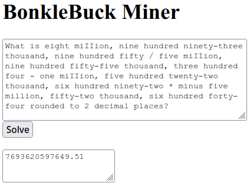

# Bonklebuck Solver

A completely frontend webapp that solves Bonklebuck problems.



## Motivation

A friend of mine had a Discord bot that simulated a cryptocurrency-like economy
called [Bonklebuck](https://github.com/JacobFSutherland/BonkleBuck/). In it's
early stages, it used simple math problems as the "proof of work", written in
english with intentional spelling mistakes to prevent automated solving. Except
it didn't, and this repo contains a solver.

Eventually they were [replaced with
captchas](https://github.com/JacobFSutherland/BonkleBuck/commit/cc3164c33e04d8b08c6eab6554493184a82f16fe#diff-01a7a1ea63da0042fbde7e348f1b63a7d61996d0d05bc5b5c3eaa62fbf0aa1dcL140-L161)
and the solver became useless 🥲

## Tech

I used ClojureScript for this project because I'd mostly been watching this
technology from afar before this and I wanted to get my hands dirty with it.

There are a few core libraries that made this work:

### Reagent

A React wrapper for ClojureScript. Instead of using hooks, you use reactive
atoms that trigger a re-render when mutated. HTML is represented as a DSL using
vectors, so your components can be composed like functions. Overall, it's a very
similar experience to React but without the hooks.

### Instaparse

A parser generator, this library is incredible. You write a grammar and it
produces an AST (again, using a vector DSL). Since the AST is just regular
Clojure data, I can pass it into a recursive evaluator and get a result super
easily. Also the grammar language is very rich and easy to understand.

## Implementation

The core of the application is simple. There are pieces of global state: `input`
and `output`, which both contain some text from fields on a form. The `solve`
function simply reads in the text, parses it into an AST, evaluates the AST to a
solution, rounds the number, and formats it as a string. This result is then
stored in `output`, which triggers a rerender and is displayed on the page.

```clojurescript
(defonce input (r/atom ""))
(defonce output (r/atom ""))

(defn solve []
  (reset! output (-> @input
                     (bonkle-parser)
                     (eval-bonkle)
                     (round)
                     (str))))

```

The UI is very simple thanks to the HTML DST that Reagent uses. The relevant
components read input, display output, and call the `solve` function.

```clojurescript
(defn inputarea []
  [:textarea {:value @input
              :placeholder "Please enter the bonkle problem here."
              :on-change #(reset! input (-> % .-target .-value))}])

(defn outputarea []
  [:textarea {:value @output
              :readOnly true
              :placeholder "Enter a problem above to get the solution."}])

(defn button []
  [:button {:on-click #(solve)}
   "Solve"])
```

The `bonkle-parser` function is generated using Instaparse's `defparser` macro,
with the parsing grammar passed in as a string argument.

```clojurescript
(defparser bonkle-parser "
solution = w? <'What is'> w total w <'rounded to 2 decimal places?'> w?
<w> = <#'\\s+'>

total = expr1

<expr1> = addExpr | subExpr | expr2
addExpr = expr1 <add> expr1
subExpr = expr1 <sub> expr1

<expr2> = mulExpr | divExpr | amount
mulExpr = expr2 <mul> expr2
divExpr = expr2 <div> expr2

add = w <'+'> w
sub = w <'-'> w
mul = w <'*'> w
div = w <'/'> w

... SNIP ...")
```
The `eval-bonkle` function is a recursive evaluator that recurses down the AST,
first constructing numbers from their word representation, then evaluating the
math expressions on those numbers (order of operations is handled in the parser,
so the evaluator is very simple).

```clojurescript
(defn eval-bonkle [ast]
  (if-not (vector? ast)
    ast
    (case (ast 0)
      :solution (eval-bonkle (ast 1))
      :total (eval-bonkle (ast 1))

      :addExpr (+ (eval-bonkle (ast 1)) (eval-bonkle (ast 2)))
      :subExpr (- (eval-bonkle (ast 1)) (eval-bonkle (ast 2)))
      :mulExpr (* (eval-bonkle (ast 1)) (eval-bonkle (ast 2)))
      :divExpr (/ (eval-bonkle (ast 1)) (eval-bonkle (ast 2)))
      ;; ... SNIP ...
      )))
```

And there you have it! Now you too can automate parsing and evaluating arbitrary
languages that are only supposed to be read by humans!
